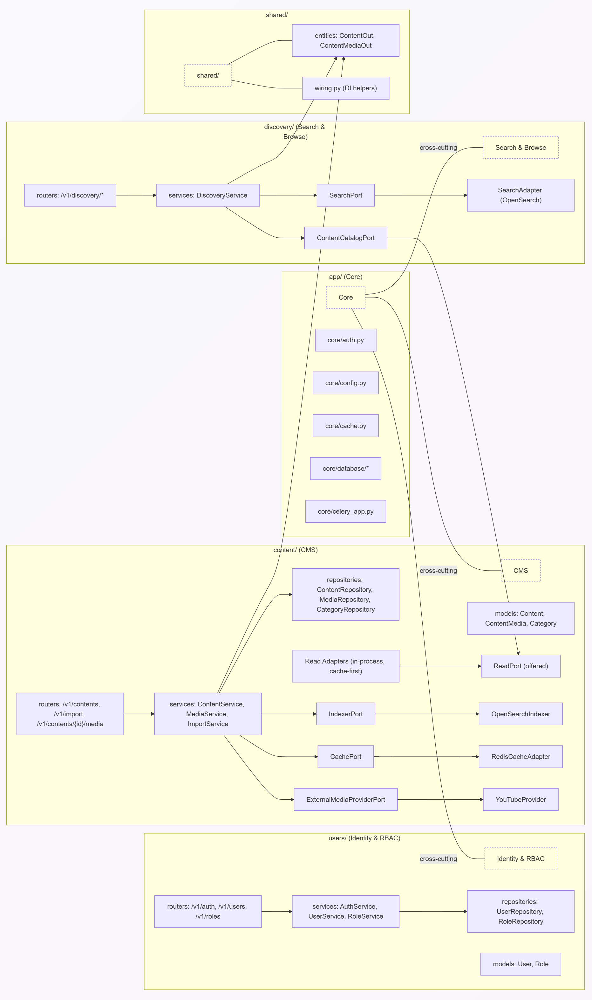

# 🧭 Design Philosophy (DDD, Hexagonal, SOLID, Low Coupling)

This codebase is a **modular monolith** that applies **Domain‑Driven Design** and **Hexagonal Architecture (Ports & Adapters)** to keep domain logic independent from infrastructure, achieve **low coupling**, and enable an easy path to **microservices**.

---

## 1) Guiding Principles

### Domain‑Driven Design (DDD)
- **Bounded Contexts**: `content/` (CMS), `discovery/` (Search/Browse), `users/` (Identity/RBAC).  
  Each owns its models, repositories, and services.
- **Published Language**: `shared/entities` are the **read DTOs** exposed across contexts; they are stable and versionable.
- **Aggregates & Invariants**: `Content` (root) with `ContentMedia` (1:1) and many‑to‑many `Category`. `User` with `Role` assignments.
- **Context Mapping**: Discovery depends on CMS via a **Read Port** (anti‑corruption). No direct access to CMS’ ORM or repos.

### Hexagonal (Ports & Adapters)
- **Ports** (interfaces) describe what a domain **needs** or **offers**.
- **Adapters** bind ports to implementations
- **Composition Root** (FastAPI routers + `shared/wiring.py`) wires services to adapters.

### SOLID in Practice
- **SRP**: Services orchestrate use‑cases; repositories persist; adapters talk to infra; routers expose HTTP.
- **OCP**: Add a new provider (e.g., Vimeo) by implementing a port, no changes in services.
- **LSP**: Any adapter can replace another for the same port.
- **ISP**: Small, focused ports (`SearchPort`, `CachePort`, `IndexerPort`, `ExternalMediaProviderPort`, `ReadPort`).
- **DIP**: Services depend on **ports**; adapters depend on infra.

---

## 2) Component Diagram (Modules & Interactions)

> The diagram shows **who depends on whom**. Arrows point from **caller** to **abstraction/implementation** it depends on.

**Notes** 📝: 
- CMS offers ReadPort, and Discovery depends on it.
- CMS uses outbound ports for cache & indexer. Adapters implement those.
- shared/entities are the stable data shapes for cross‑context reads.

---

## 3) How Low Coupling Is Enforced

- Services depend on ports, not on concrete adapters.
- Adapters live at the edges and are plugged in via DI (routers / shared/wiring.py).
- Repositories are context‑local and never imported by other contexts.
- Published DTOs in shared/entities are the only shapes Discovery sees from CMS.
- Routers are thin: composition only, no business logic.

--- 

## 4) Consequences & Benefits
- Swap infra without rewrites: Replace Redis/OpenSearch/Provider by swapping adapters.
- Safer refactors: ORM changes don’t ripple across contexts; the Read Port + DTOs are stable.
- Testability: Mock ports to unit‑test services; integration tests focus on adapters.
- Microservice‑ready: Replace CMSReadInProcessAdapter with an HTTP/gRPC adapter; domains stay intact.

---

## 5) From Monolith to Microservices (Seamless)
- Keep the ports; switch adapters from in‑process to HTTP.
- Keep the DTOs; publish as versioned contracts.
- Add events (outbox) to push changes to Discovery for indexing.

---
## 💡 Read Next
1. [Overview](00-Overview.md)
2. [Architecture](01-Architecture.md)
3. Design Philosophy 👈🏼
4. [DDD & Separation of Concerns](03-DDD-and-Separation-of-Concerns.md)
5. [API Documentation](04-API-Documentation.md)
6. [Business Flows](05-Business-Flows.md)
7. [Deployment Guide](06-Deployment.md)