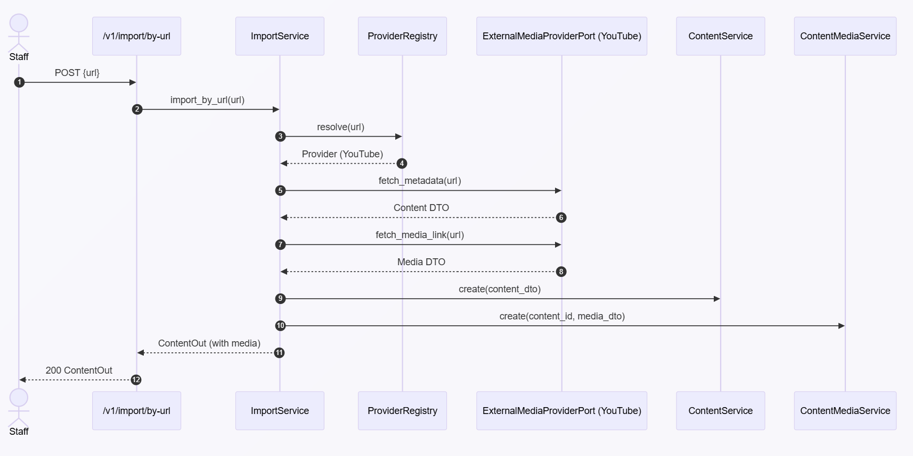

# Business Flows

This document explains the end‑to‑end flows across **Auth**, **Users**, **CMS (Content & Media)**, **Import**, and **Discovery**, including how **cache** and **indexing** are used and when **background tasks** run.

> Notation:
> - **Router** = FastAPI HTTP layer
> - **Service** = Application service (use‑case orchestration)
> - **Repo** = Repository
> - **Ports** = Interfaces (CachePort, IndexerPort, SearchPort, ReadPort)
> - **Adapters** = Implementations (Redis, OpenSearch, YouTube, etc.)
> - **DTOs** = Pydantic entities (`shared/entities`)

---

## 1) Authentication — Issue Token

**Goal**: Exchange credentials for a JWT token.

**API**: `POST /v1/auth/token`

**Flow**:
1. **Auth Router** validates request body.
2. **AuthService** loads user by email (UsersRepo).
3. Verifies password hash; ensures user is active.
4. Issues JWT (roles included as claims).
5. Returns `TokenOut`.

**Notes**
> - No cache involved.
> - Token lifetimes are configurable.
> - Roles: admin, editor (staff), viewer.

---

## 2) Users Create & Assign Roles

**APIs**:

- POST /v1/users (admin only)
- PUT /v1/users/{id}/roles (admin only)
- GET /v1/users/me (any authenticated user)

**Create User Flow (admin)**:
- Users Router authorizes admin.
- UserService.create() validates and hashes password.
- UsersRepository inserts user.
- Optional: initial roles assignment.

**Assign Roles Flow (admin)**:
- Users Router authorizes admin.
- UserService.assign_roles() validates roles.
- Updates join table (user_roles).

---

## 3) CMS — Content Lifecycle

**APIs**:
- POST /v1/contents (staff)
- PATCH /v1/contents/{id} (staff)
- DELETE /v1/contents/{id} (staff)
- GET /v1/contents (public; optional auth)
- GET /v1/contents/{id} (public; optional auth)

**Create Flow (with cache + indexing trigger)**:
- Contents Router authorizes staff.
- ContentService.create()
- Validates DTO.
- ContentRepository inserts.
- CachePort.set caches the content:{id}.
- Enqueues Celery task to index content in OpenSearch.
- Returns ContentOut.

**Update Flow**: 
- Same as create, but repo update(), cache refresh, enqueue re‑index.

**Delete Flow**:
- Repo delete(id), cache invalidate (content:{id} + media:{content_id}), enqueue delete_from_index(id).

Public Reads (list/get):
- Cache‑aside policy:
  - Try cache → on miss → repo → set cache → return.
- No OpenSearch in CMS reads; that’s Discovery’s job.

---

## 4) CMS — Media Lifecycle (Create/Update/Delete)

**APIs**:
- GET /v1/contents/{id}/media (public; optional auth)
- POST /v1/contents/{id}/media (staff)
- PATCH /v1/contents/{id}/media (staff)
- DELETE /v1/contents/{id}/media (staff)

**Create/Update Flow**:
- Media Router authorizes staff for write.
- ContentMediaService upserts media via MediaRepository.
- Cache:
  - set("media:{content_id}", media_dto)
  - Consider invalidating content:{id} if content includes embedded media.
- Enqueue index refresh so Discovery sees the latest media info.

**Delete Flow**: 
- Repo delete, cache delete media:{content_id}, enqueue reindex (content exists but w/o media).

Public Read (GET /media): cache‑aside.

---

## 5) Import: By External URL (e.g., YouTube)

**API**: POST /v1/import/by-url (staff)

**Flow**:
- Imports Router authorizes staff.
- ImportService.import_by_url(url):
- ProviderRegistry selects a provider that supports(url).
- Provider fetches metadata and media link (adapter implements ExternalMediaProviderPort).
- ContentService + ContentMediaService persist items (normal CMS create flows).
- Both cache and index are updated as usual.
> **Notes**
> - Easy to add Vimeo, SoundCloud, etc. Implement the same port and register it.

---

## 6) Discovery: Search & Hydrate

**APIs**:
- GET /v1/discovery/search
- GET /v1/discovery/contents/{id}

**Search (Browse) Flow**:
- Discovery Router (public; optional auth).
- DiscoveryService.browse():
- Query SearchPort (OpenSearch adapter) → returns list of content IDs.
- For each ID, CMS Read Port (in‑process adapter) fetches details:
  - Cache‑first (content:{id}), falls back to CMS read via repositories.
- Return hydrated ContentOut[].

---

## 💡 Read Next
1. [Overview](00-Overview.md)
2. [Architecture](01-Architecture.md)
3. [Design Philosophy](02-Design-Philosophy.md)
4. [DDD & Separation of Concerns](03-DDD-and-Separation-of-Concerns.md)
5. [API Documentation](04-API-Documentation.md) 
6. Business Flows 👈🏼
7. [Deployment Guide](06-Deployment.md)
 